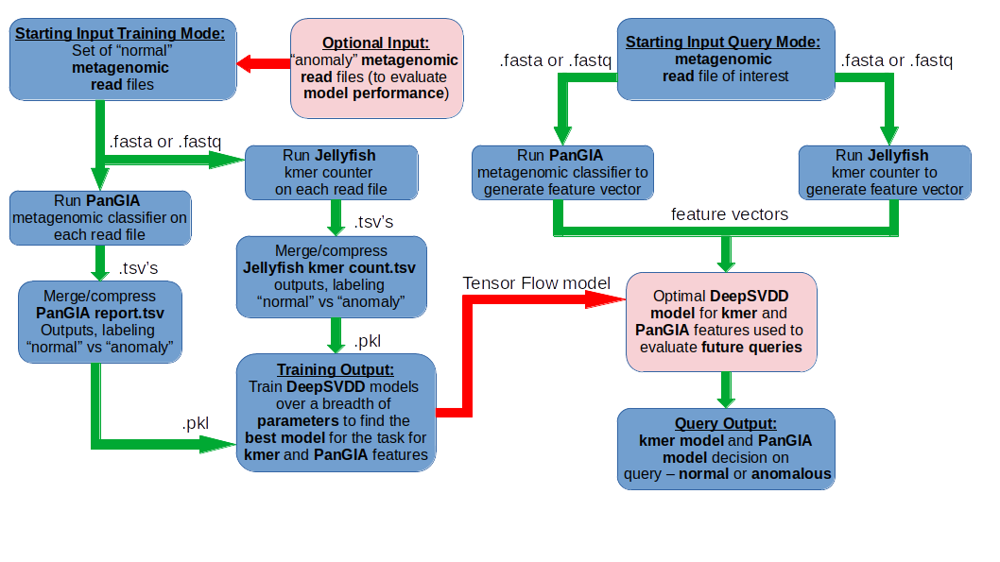

# metagenomic_anomaly_detector

A generalizable framework to create anomaly-detecting DeepSVDD models of metagenomic samples. takes .fasta/.fastq formatted short read inputs and returns a model and/or scores from the model on test samples. GPU acceleration will be automatically employed if available at training time.

The tool can be constructed using conda simply with the provided .yml.
* If you dont have miniconda, see installation here: https://docs.conda.io/en/latest/miniconda.html
    * Download the latest linux version
    * Navigate to the file you installed (should be named 'Miniconda3-latest-Linux-x86_64.sh',likely in the Downloads folder) and execute the following in terminal:
    ```
    ./Miniconda3-latest-Linux-x86_64.sh
    ```
Follow and agree to the installation prompts. You may need to restart your terminal session at the conclusion of installation.

Enter the base conda environment, and create the metagenomic anomaly detector conda environment from the .yml
```
conda activate base
conda env create -f metagenomic_anomaly_detector.yml
conda activate metagenomic_anomaly_detector
```

From here, construct the following expected folders for the command defaults (note: if you specify folders at runtime this is not necessary)
```
mkdir anomaly_dir
mkdir control_dir
mkdir models
mkdir test_samples
mkdir test_sample_scores
```

To complete set up, install the PanGIA database by running the following command:
```
wget PLACEHOLDER_LINK_TO_PANGIA_DB ./tools/pangia_db/
```

# The Workflow Overview



The main set of analysis is carried out by running three scripts in succession:
* run_pangia_jellyfish.py
* compile_and_compress_outputs.py
* train_DeepSVDD.py

Which will in full, from fasta/fastq inputs in specified folder locations, generate feature vectors and train DeepSVDD models over a small grid search to return an optimally fit model. A fourth optional script can be run with a trained model to evaluate testing data after this process is completed:
* get_score_from_model.py

Each script comes with command line arguments that can be checked by passing --help. The processes are detailed script-by-script below.

# run_pangia_jellyfish.py
```
  -a ANOMALY_DIR, --anomaly_dir ANOMALY_DIR
                        Directory of anomalous samples. Can be left empty if none exist (default=anomaly_dir)
  -c CONTROL_DIR, --control_dir CONTROL_DIR
                        Directory of typical, normal, control samples (default=control_dir)
  -t THREADS, --threads THREADS
                        Threads to use in processing (default=4)
  -p PAIRED, --paired PAIRED
                        Are samples paired? Paired samples must have "R1" and "R2" before the .fastq/.fastq/.fa/.fq (default=False)
  -k KMER_SIZE, --kmer_size KMER_SIZE
                        Specify size of kmers to count (default=4)
```
Place expected typical metagenomic sample data in the CONTROL_DIR. Optionally, place any expected anomalous samples in the ANOMALY_DIR. It can be fasta or fastq formatted, and may be paired files. The script runs the PanGIA metagenomic classifier and the Jellyfish kmer counter and outputs a .tsv file for each method. The kmer size to count may be specified but high kmer sizes are impractical, 3 to 5 has been found to be a good range.

# compile_and_compress_outputs.py
```
  -a ANOMALY_DIR, --anomaly_dir ANOMALY_DIR
                        Directory of anomalous sample outputs (default=anomaly_dir)
  -c CONTROL_DIR, --control_dir CONTROL_DIR
                        Directory of typical, normal, control sample outputs (default=control_dir)
  -ok OUTPUT_KMER, --output_kmer OUTPUT_KMER
                        The name of output kmer file (default=all_kmer_outputs)
  -op OUTPUT_PANGIA, --output_pangia OUTPUT_PANGIA
                        The name of the output pangia file (default=all_pangia_outputs)
  -n NAMES_FILE, --names_file NAMES_FILE
                        file containing names of the pangia database taxa (default=tools/species_taxids_from_pangia_db.txt)
  -m MAKE_NAMES_FILE, --make_names_file MAKE_NAMES_FILE
                        remake names file? (should not be updated between runs and only if PanGIA DB has changed) (default=False)

```
After running run_pangia_jellyfish.py, the next step is to compile and compress the output .tsvs into a single tabular pickled object. Specify the same ANOMALY_DIR and CONTROL_DIR as in the first step. Set --make_names_file to True if this is the first time running the pipeline, or if the PanGIA database has been recently updated. Binary labels are assigned here depending on if the reads file came from the anomaly or control directory.

# train_DeepSVDD.py
```
  -k KMER_PKL, --kmer_pkl KMER_PKL
                        name of compiled compressed kmer object (default=all_kmer_outputs.pkl)
  -p PANGIA_PKL, --pangia_pkl PANGIA_PKL
                        name of compiled compressed PanGIA object (default=all_pangia_outputs.pkl)
  -e EPOCHS_TO_TRAIN, --epochs_to_train EPOCHS_TO_TRAIN
                        how many epochs should each model parameterization be trained (default=200)
  -a ANOMALY_PRESENT, --anomaly_present ANOMALY_PRESENT
                        set to True if anomaly data provided (default=None)
```
Specify the outputs from the compile_and_compress_outputs.py step above. If anomaly data is present, specify -a to be True. The output model and model metadata will be placed into ./models/ folder. The metadata .json output contains the final scorings of the control and anomaly data that can be used by the user to identify if an adequate to their standards threshold can be chosen.

# get_score_from_model.py
```
  -t THREADS, --threads THREADS
                        number of threads to employ where applicable (default=4)
  -d DEEPSVDD_MODEL, --deepsvdd_model DEEPSVDD_MODEL
                        which model to test on (default=./models/PanGIA_svdd_model)
  -m METADATA, --metadata METADATA
                        metadata file that acompanies name of model (default=./models/PanGIA_svdd_model_metadata.json)
  -s DIR_TO_SCORE, --dir_to_score DIR_TO_SCORE
                        in which directory are the files to score stored (default=test_samples)
  -p PAIRED, --paired PAIRED
                        Are samples paired? Paired samples must have "R1" and "R2" before the .fastq/.fastq/.fa/.fq (default=False)
```
After training a model, additional samples may be evaluated by placing them into the ./test_samples/ folder (or other specified test folder). Choosing a trained DeepSVDD model for the -d parameter and it's corresponding metadata .json for the -m parameter may be done with the default being the default named PanGIA model. As in training, paired samples may be used here as long as they follow naming conventions. The output will be placed into ./test_sample_scores/ directory in .csv format.
